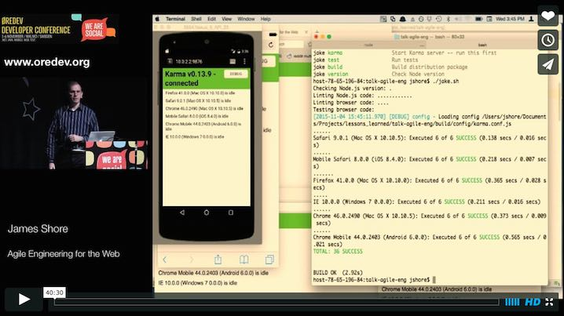

Quixote Example
===========

This example code is based on my "Agile Engineering for the Web" talk, first presented at Øredev in Malmö Sweden on 4 Nov 2015. The talk demonstrates test-driven development of front-end JavaScript and CSS. You can see it online here:

[](https://vimeo.com/144642399)

The Quixote portion starts at 21:50.

There have been some changes to the example since the video was recorded. The biggest change is to Quixote's assertion API. The assertions in the video look like this (see 27:18):

```javascript
figure.assert({
  left: frame.body().left
});
```

This assertion checks that the left edge of the 'figure' element is the same as the left edge of the page's body element.

The current version of Quixote provides a more natural API. The same assertion now looks like this:

```javascript
figure.left.should.equal(frame.body().left);
```

The code in this example uses this style.


About the Example
-----------------

This code demonstrates CSS and JavaScript tests. It uses:
 
* [Karma](http://karma-runner.github.io) for cross-browser testing.
* [Mocha](https://mochajs.org/) for running tests.
* [Chai](http://chaijs.com/) for assertions.
* [Quixote](https://github.com/jamesshore/quixote) for testing CSS.

The sample application uses Nicole Sullivan's [media object](http://www.stubbornella.org/content/2010/06/25/the-media-object-saves-hundreds-of-lines-of-code/) to display an icon with some text. Clicking the icon causes the text to appear and disappear.

Important files:

* [`src/_media_css_test.js`](src/_media_css_test.js): CSS tests

* [`src/screen.css`](src/screen.css): CSS code

* [`build/config/karma.conf.js`](build/config/karma.conf.js): Karma configuration. Look for the `// QUIXOTE` comment to see how to make Karma serve CSS files.
  

Running the Tests
-----------------

Before running the tests:

1. Install [Node.js](http://nodejs.org/download/).
2. Install Quixote: `npm install quixote`
3. Change to the example directory: `cd node_modules/quixote/example`

To run the tests:

1. Start the Karma server: `./jake.sh karma` (Unix/Mac) or `jake karma` (Windows)
2. Open `http://localhost:9876` in one or more browsers.
3. Run `./jake.sh loose=true` (Unix/Mac) or `jake loose=true` (Windows) every time you want to build and test. Alternatively, use `./watch.sh loose=true` (Unix/Mac) or `watch loose=true` (Windows) to automatically run `jake` whenever files change.

Remove the `loose=true` parameter for strict Node and browser version checking.

To run the app:

1. Run `./jake.sh run` (Unix/Mac) or `jake run` (Windows).
2. Open `http://localhost:8080` in a browser.
3. Click the coffee cup icon to see the text appear and disappear.


Contents
--------

This repository consists of the following directories:

* `build`: Build automation.
	* `build/config`: Build configuration.
	* `build/scripts`: Build scripts. Don't run them directly.
	* `build/util`: Modules used by the build scripts.
* `node_modules`: npm dependencies (used by the build).
* `src`: Front-end code.
* `vendor`: Client code dependencies.

In the repository root, you'll find the following scripts. For each script, there's a `.sh` version for Unix and Mac and a `.bat` version for Windows:

* `jake`: Build and test automation.
* `watch`: Automatically runs `jake` when any files change. Any arguments are passed through to jake.

For all these scripts, use `-T` to see the available build targets and their documentation. If no target is provided, the script will run `default`. Use `--help` for additional options.

The scripts have these additional options:

* `loose=true`: Disable strict browser and version checks.
* `capture=Firefox,Safari,etc`: Automatically launch, use, and quit the requested browsers. You can use this instead of running `./jake.sh karma` and manually starting the browsers yourself. Note that the browser name is case-sensitive. The Firefox launcher is included; if you need additional launchers, you'll need to install them; e.g., `npm install karma-safari-launcher`.


License
-------

MIT License. See `LICENSE.TXT`.